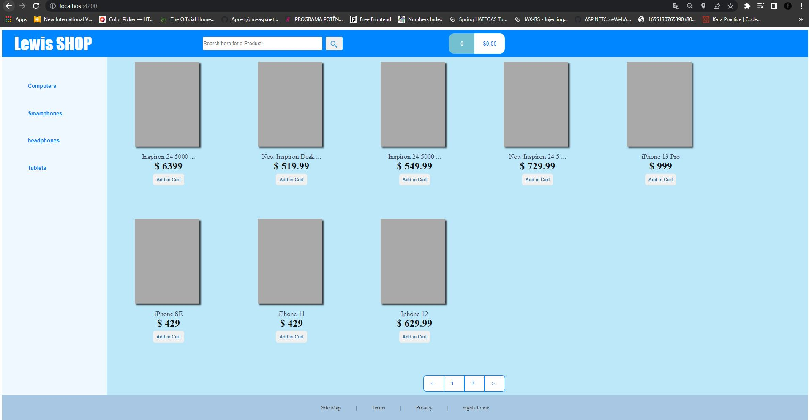
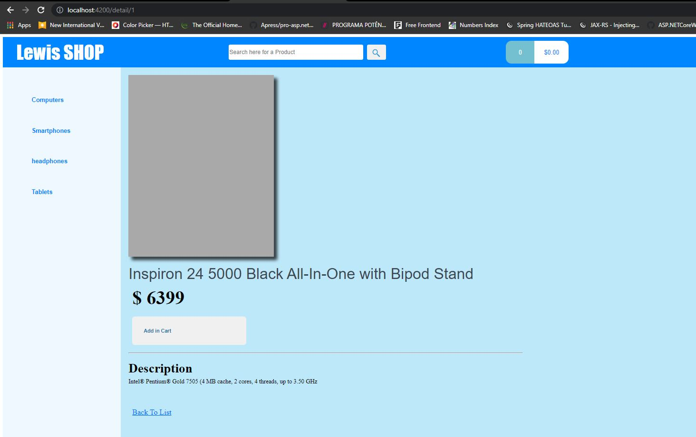
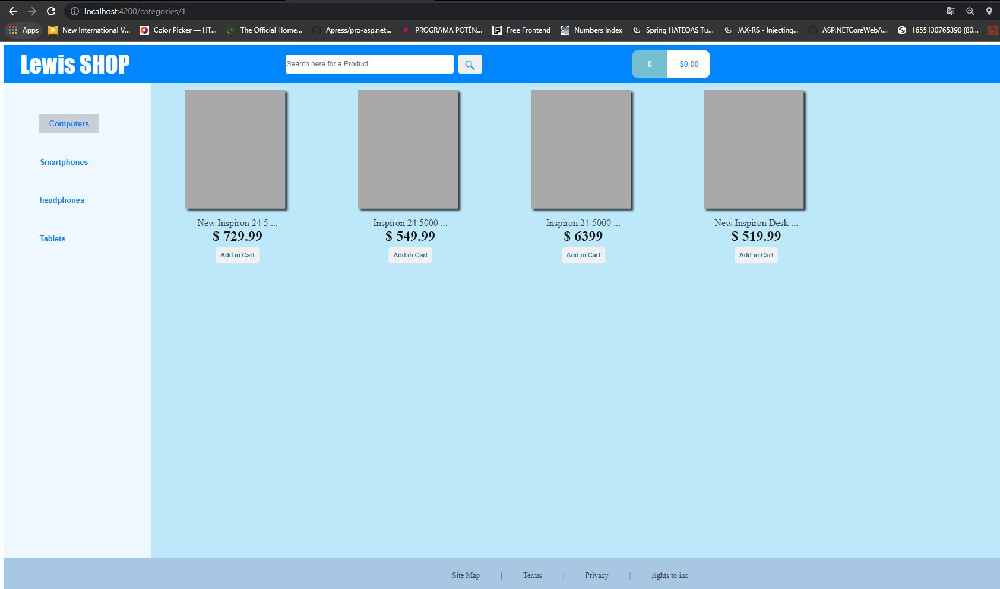
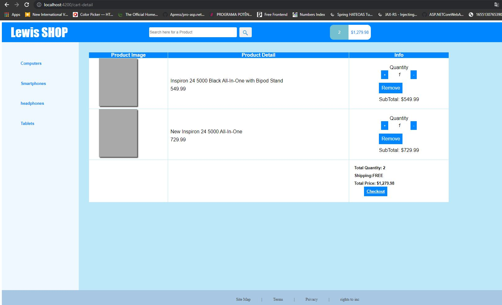
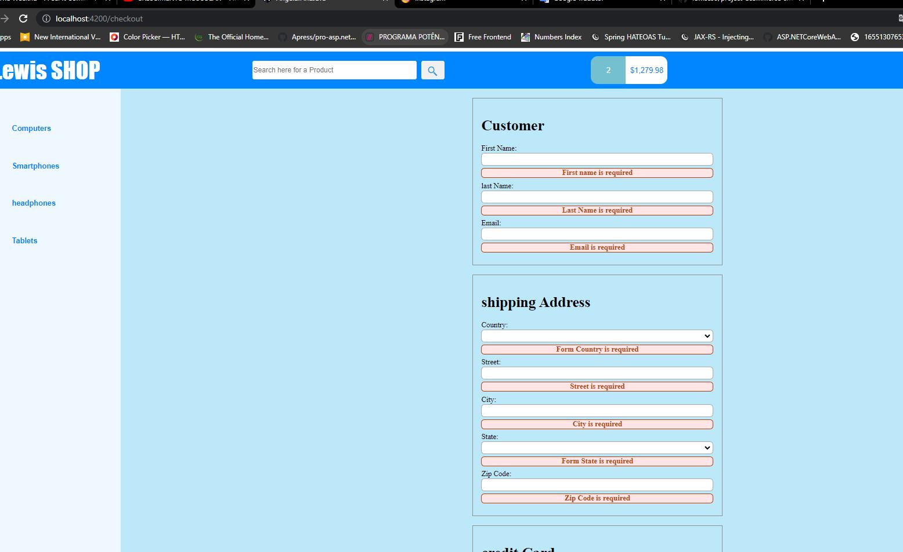
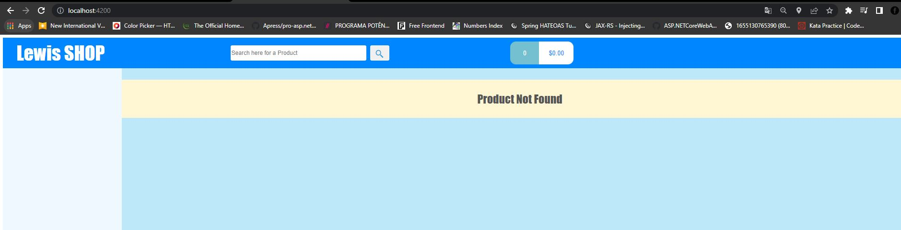
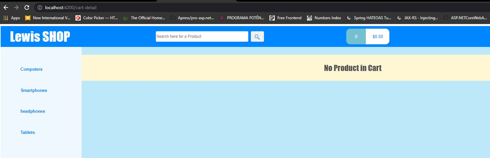

# JAVA SPRING BOOT AND ANGULAR 2 - ECOMMERCE WEBSITE

 
<h2>Description English</h2>

With Ecommerce Website Mock Project, you can experience all the main functionalities
  without having to invest in a definitive platform. Add products to cart, search by name and category,
  remove unwanted items and even add quantities as needed. And best of all: checkout
  adding your personal data and feel what your customer's experience would be like when buying in your virtual store.
   Try the Ecommerce website simulation project right now and be surprised by the result..

<h2>Descrição Português</h2>

Com o  projeto de simulação de site de Ecommerce, você pode experimentar todas as principais funcionalidades
 sem precisar investir em uma plataforma definitiva. Adicione produtos ao carrinho, pesquise por nome e categoria,
 remova itens indesejados e até mesmo adicione quantidades conforme a sua necessidade. E o melhor de tudo: finalize a compra
 adicionando seus dados pessoais e sinta como seria a experiência do seu cliente ao comprar em sua loja virtual.
  experimente agora mesmo o projeto de simulação de site de Ecommerce e se surpreenda com o resultado.

 

 
## 🚀 Tech Used 
 
- Spring Boot 
- H2-database  
- HTML e CSS Typescript  
- Hibernate Jpa 
- Angular 2  

 

## 🖼 Screenshot APPLICATION SCREENS  

How to Run

 
 

Initial Page

 
 

Product Detail

 
 

Product By Category

 
 

Cart Detail 

 
 

Checkout

 
 

Error Page

 
 

No Product In Cart

 
 

## Linkedin abaixo

<h4 align="center">
   Created by   <a href="https://www.linkedin.com/in/luiz-carlos-b50693173/" target="_blank"> Luiz Carlos </a>
</h4>
</html>
